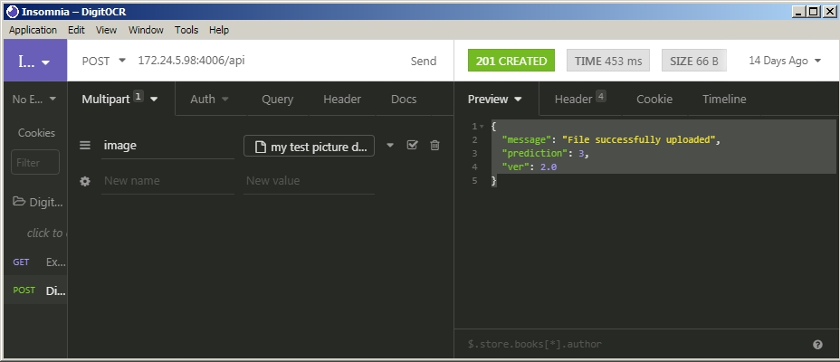

# Microservices

Target is to split the code into two parts, with the OCR part acting as a microservice

## Let's Specify our API

  The api definition
  
* Endpoint : <http://url/api>
* Method : POST
* Content : Multi-part form
          name: image
          content : the .jpg file
* Expect reponse format :

     {
          "message": "File successfully uploaded",
          "prediction": 3,
          "ver": 2.0
     }

## Develop the Frontend & Backend

TASK : Each of the trainee would develop either the Frontend or the Backend code.  Follow the API specs above

FRONTEND developer - there is a working backend for you <code>appapi-backend.pi</code>.  Run it.  Then test your code against it.

BACKEND developer - use Insomnia to generate the RESTAPI call to test your code (follow picture to setup the Incomsia)
